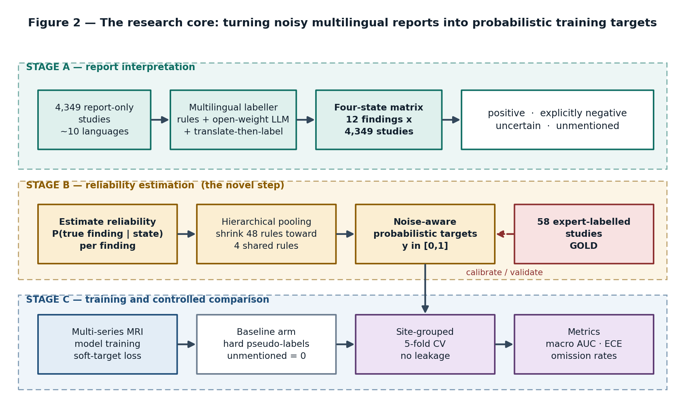
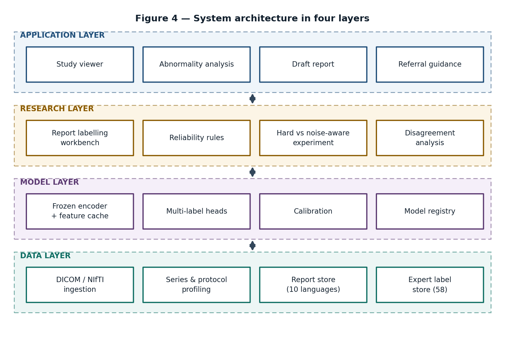

<div align="center">

# KneeWS

### Noise-Aware Weak Supervision from Multilingual Radiology Reports for Multi-Label Knee MRI Analysis

[](https://github.com/aimal-khan/KneeWS/actions/workflows/ci.yml)
[](https://www.python.org/)
[](https://www.kaggle.com/competitions/rsna-knee-abnormality-detection)
[](https://www.kaggle.com/competitions/rsna-knee-abnormality-detection)
[](https://nu.edu.pk/)

**[FAST-NUCES](https://nu.edu.pk/) · Final Year Project 2025–2026**

*Aimal Khan · Hunzala Alam · Supervisor: Mr. Mohsin Khan*

</div>

---

## Abstract

Structured labels for knee MRI studies are expensive and scarce: the RSNA Knee Abnormality Detection dataset contains 4,407 training studies but only 58 with complete expert binary labels. **KneeWS** addresses this supervision gap by deriving soft training targets from multilingual free-text radiology reports using rule-based natural language processing, then calibrating those noisy labels against the small gold-standard set using hierarchical empirical-Bayes shrinkage. The approach avoids the base-rate collapse failure mode common in naive soft-label schemes and improves multi-label multi-class Kaggle public AUC from 0.613 (rule-only baseline) to **0.664** without additional labeled data. The system predicts 12 knee abnormalities simultaneously across three MRI planes using a 2.5D EfficientNet-B0 backbone.

---

## Key Results

| Model Version | Backbone | Label Strategy | Kaggle Public AUC | OOF AUC (58 gold) |
|:---:|:---:|:---|:---:|:---:|
| V01 | EfficientNet-B0 | Rule-based weak labels (flat) | 0.613 | — |
| V02 | EfficientNet-B0 | Fold-safe calibrated soft labels | — | Collapsed (base-rate) |
| **V03** | **EfficientNet-B0** | **Hierarchical pooled state priors** | **0.664** | **0.632** |
| V04 *(in progress)* | DINOv2-S ViT-S/14 | V03 labels + laterality norm + attention pool | — | — |

> V03 achieved a **+8.3% relative improvement** over the V01 baseline. The leading public DINOv2 solution scores 0.809 (pilkwang baseline); V04 targets this architecture.

---

## System Architecture

<div align="center">

### Training Pipeline



### System Layers



</div>

### Method Overview

```
Radiology Report (multilingual)
    → Rule-based NLP weak labeler
    → Label states: {explicit_positive, explicit_negative, unmentioned}
    → Hierarchical empirical-Bayes calibration against 58 gold studies
    → Soft targets + confidence weights

MRI Study (3-plane DICOM)
    → Series selection (fluid-sensitive priority)
    → Spatial sorting (ImagePositionPatient projection)
    → Uniform center sampling → 2.5D triplets [n-gap, n, n+gap]
    → Shared EfficientNet-B0 (or DINOv2-S in V04)
    → Mean pooling per plane → concatenate + sequence metadata
    → Linear multilabel head → 12 abnormality logits
```

**Predicted abnormalities:** ACL · MCL · Medial Meniscus · Lateral Meniscus · Medial OA · Lateral OA · PF OA · Effusion · Synovitis · Baker's Cyst · Contusion · Fracture

---

## Repository Structure

```text
KneeWS/
├── .github/
│   ├── workflows/
│   │   ├── ci.yml                      # Notebook validation + test suite
│   │   └── lint.yml                    # ruff + black formatting checks
│   └── ISSUE_TEMPLATE/
│       ├── bug_report.md
│       └── feature_request.md
├── assets/
│   └── figures/                        # Architecture and pipeline diagrams
├── docs/
│   ├── proposal/                       # Proposal defence presentation decks
│   └── KneeWS_Project_Record.docx     # Full 25-page project record
├── notebooks/
│   ├── v01-rsna-knee-2p5d-baseline.ipynb   # EfficientNet-B0 + flat weak labels
│   ├── v02-rsna-knee-2p5d-baseline.ipynb   # Calibrated soft labels (base-rate collapse fixed in V03)
│   ├── v03-rsna-knee-2p5d-baseline.ipynb   # Hierarchical calibration [CURRENT]
│   ├── v04-rsna-knee-2p5d-baseline.ipynb   # DINOv2-S + laterality norm [IN PROGRESS]
│   └── rsna-knee-submission.ipynb           # Ensemble inference + submission
├── prototypes/
│   ├── walkthrough/                    # Guided 6-step interactive demo
│   └── dashboard/                      # 11-screen feature explorer
├── scripts/
│   ├── inspect_kaggle_train_images.py  # DICOM data audit tool
│   └── serve_prototypes.py             # Local prototype server
├── tests/
│   └── test_smoke.py                   # Structural integrity checks
├── CONTRIBUTING.md
├── CODE_OF_CONDUCT.md
├── requirements.txt
└── README.md
```

---

## Quickstart

### Prerequisites

- Python 3.10+
- GPU with CUDA (for training; Kaggle T4 x2 used for experiments)
- Kaggle account + RSNA Knee Abnormality Detection dataset access

### Installation

```bash
git clone https://github.com/aimal-khan/KneeWS.git
cd KneeWS
pip install -r requirements.txt
```

### Running the Prototypes (No Setup Required)

The interactive HTML prototypes are self-contained — no server or internet connection needed:

```bash
# Option A: Open directly in browser
open prototypes/walkthrough/kneews_walkthrough.html

# Option B: Use the local server (supports all 4 prototypes simultaneously)
python scripts/serve_prototypes.py
```

### Running Notebooks on Kaggle

1. Upload `notebooks/v03-rsna-knee-2p5d-baseline.ipynb` to Kaggle
2. Attach the [RSNA Knee Abnormality Detection](https://www.kaggle.com/competitions/rsna-knee-abnormality-detection) dataset
3. Select a GPU accelerator (T4 x2 recommended)
4. Set `cfg.folds_to_train = (0,)` for a quick single-fold validation, or keep `(0, 1, 2, 3, 4)` for full training
5. Run all cells — the notebook auto-resumes from the last `*_last.pt` checkpoint if the runtime limit triggers

For submission inference only, use `notebooks/rsna-knee-submission.ipynb` and attach trained checkpoints.

---

## Notebooks

| Version | File | Key Change | Status |
|:---:|:---|:---|:---:|
| V01 | `v01-rsna-knee-2p5d-baseline.ipynb` | Initial 3-plane 2.5D EfficientNet-B0 with rule-based weak labels | ✅ 0.613 |
| V02 | `v02-rsna-knee-2p5d-baseline.ipynb` | Fold-safe calibrated soft labels, gold weight 8, resumable training | ⚠️ Base-rate collapse |
| **V03** | **`v03-rsna-knee-2p5d-baseline.ipynb`** | **Hierarchical pooled state priors, ordering constraints, collapse diagnostic** | **✅ 0.664** |
| V04 | `v04-rsna-knee-2p5d-baseline.ipynb` | DINOv2-S ViT-S/14, laterality normalization, target-specific attention pooling | 🔄 Implemented, not yet trained |

See [`notebooks/README.md`](notebooks/README.md) for full version notes, hyperparameters, and failure analysis.

---

## Dataset

| Metric | Value |
|:---|---:|
| Training studies | 4,407 |
| Training MRI series | 24,371 |
| Training DICOM files | 819,078 |
| Studies with expert labels (gold) | 58 |
| Studies with reports only (weak) | 4,349 |
| Anatomical planes | Sagittal · Coronal · Axial |

**Source:** [RSNA Knee Abnormality Detection — Kaggle 2024](https://www.kaggle.com/competitions/rsna-knee-abnormality-detection)

---

## Prototypes

Two interactive zero-dependency HTML prototypes were built to demonstrate system feasibility:

| Prototype | Path | Purpose |
|:---|:---|:---|
| **Walkthrough** | `prototypes/walkthrough/` | Guided 6-step demo: report parsing → label state assignment → supervision toggle → model prediction |
| **Dashboard** | `prototypes/dashboard/` | 11-screen feature explorer mapped 1:1 to the 10 registered system features |

Both prototypes use entirely synthetic data. No real patient data or trained model weights are embedded.

---

## Design Variants

The project explored two reliability estimation strategies:

- **PRIMARY (Registered)**: Report reliability measured against the 58 expert-labelled studies
- **Option B (Reserve)**: Reliability estimated internally from the model's own confident disagreements, keeping all 58 gold studies sealed for independent evaluation

The registered title, project scope, and all 10 key system features are identical under both variants. Only the reliability estimator inside Feature 5 differs. Both prototype sets are included.

---

## Team

| Role | Name |
|:---|:---|
| Student | Aimal Khan |
| Student | Hunzala Alam |
| Supervisor | Mr. Mohsin Khan |
| Institution | [FAST-NUCES](https://nu.edu.pk/), School of Computing |
| Program | Bachelor of Science in Computer Science (FYP 2025–2026) |

---

## Citation

If you use this work or reference the KneeWS approach, please cite:

```bibtex
@misc{khan2026kneews,
  title        = {KneeWS: Noise-Aware Weak Supervision from Multilingual Radiology Reports
                  for Multi-Label Knee MRI Analysis},
  author       = {Khan, Aimal and Alam, Hunzala},
  year         = {2026},
  institution  = {FAST-NUCES, School of Computing},
  howpublished = {\url{https://github.com/aimal-khan/KneeWS}},
  note         = {Final Year Project, supervised by Mr. Mohsin Khan}
}
```

---

## Acknowledgements

- [RSNA](https://www.rsna.org/) and the Kaggle competition organizers for making the knee MRI dataset publicly available
- The authors of the leading public solutions whose leaderboard notebooks informed the V04 DINOv2 direction
- FAST-NUCES School of Computing for supporting this final year project

---

<div align="center">

*All synthetic data in prototypes is for demonstration purposes only. No real patient data is used or stored.*

</div>
